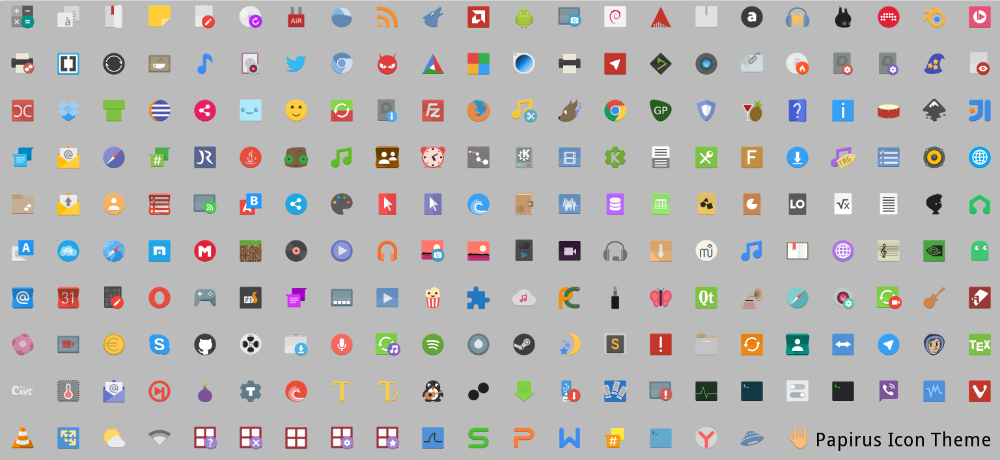
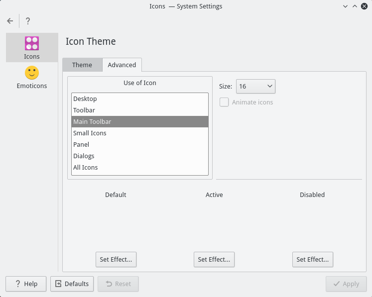

# Papirus icon theme
Modified and adaptive [Paper icon theme](https://github.com/snwh/paper-icon-theme) for KDE distros.



# Recommends
Please use 16x16 icon size for **Main toolbar**, **Toolbar** and **Panel** for best looking.

Open `System Settings - Icons - Advanced` and set size 16x16.



# Install Kubuntu 15.04/15.10
```
sudo add-apt-repository ppa:varlesh-l/papirus-pack
sudo apt-get update
sudo apt-get install papirus-icon-theme
#Optional
sudo apt-get install papirus-plasma-theme papirus-gtk-theme papirus-yakuake-theme papirus-bomi-theme
```
# Install Arch Linux
```
yaourt -S papirus-icon-theme
```
# Install for other KDE distros
```
cd /tmp
git clone https://github.com/varlesh/papirus-icon-theme.git
sudo cp -R /tmp/papirus-icon-theme/papiru* /usr/share/icons/
```
Also you can install additional icons for some applications (Krusader, Amarok, tray applications).
Please , explore directory /usr/share/icons/papirus/extra-icons